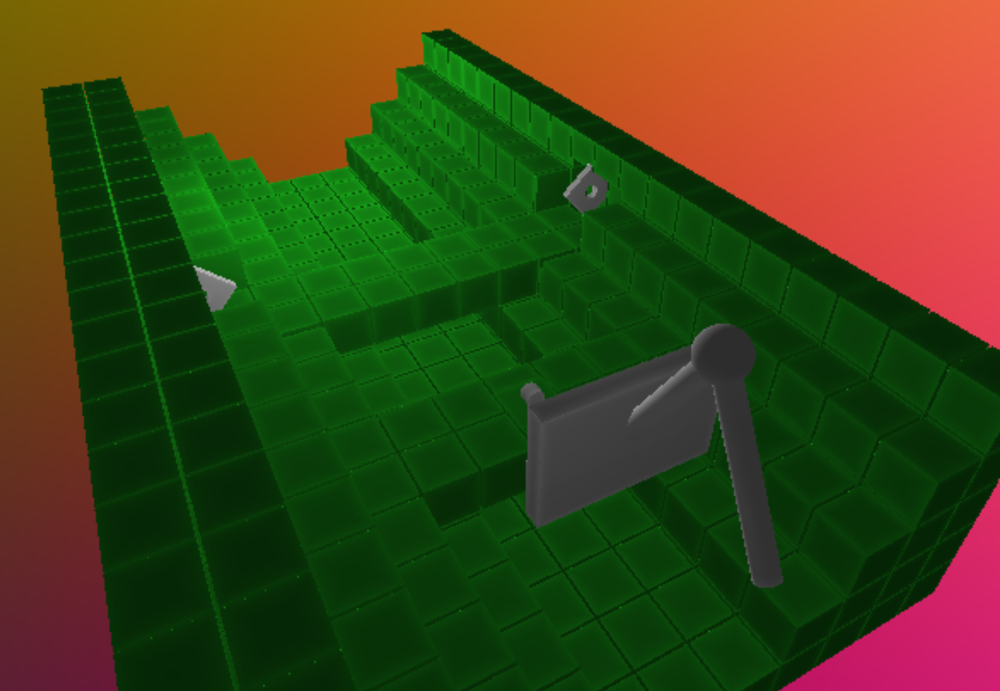

# CIS-566-Project-2
https://github.com/CIS-566-2018/homework-2-ray-marching-implicit-surfaces

## Student Info

- Name: Mauricio Mutai
- PennKey: `mmutai`

## Live Demo

- Click below for the live demo! (**Autoplays audio!**)

## Inspiration

- You will note the program plays an audio file. This shader is inspired by the rhythm game Rhythm Heaven, released for the DS. In particular, I tried to re-create the mini-game "Built to Scale", which you can see on [this video](https://www.youtube.com/watch?v=Fx2hJHWLoaI).

## Techniques Used

- The bulk of this project was developed based on IQ's publications about ray-marching SDFs. In particular, I made use of many SDFs published by him.
- The green blocks are created with a combination of **domain repetition**, **intersection**, and **subtraction** of a cube primitive. The cube is repeated on a grid, and then intersected with a scaled cube to create a rectangular subset of this grid. Other sections of this subset are subtracted away in order to create the staircase effect.
- The white squares with holes are made from a scaled cube, from which a cylinder is subtracted.
- The contraption that shoots the cylinders is made from the **addition** of two "capped cylinders", a sphere, and a scaled cube. Note I avoided the smooth blend on purpose to give this a more mechanical look.
- The animations are achieved by rotating, translating, and scaling the point used to sample each SDF accordingly. I developed an overly-complicated method of parametrizing these animations that led to the use of several uniform time variables in the shader.

## External References

- [General Resource for SDF](http://jamie-wong.com/2016/07/15/ray-marching-signed-distance-functions/#surface-normals-and-lighting)
- [IQ's article about ray-marching SDFs](http://iquilezles.org/www/articles/distfunctions/distfunctions.htm)
- [Article about bias/gain functions](http://demofox.org/biasgain.html)
- [IQ's article for help with SDF ambient occlusion](http://www.iquilezles.org/www/material/nvscene2008/rwwtt.pdf)
- [matiasm97's playthrough of "Built to Scale", from which I took the audio](https://www.youtube.com/watch?v=Fx2hJHWLoaI)

## Objective
- Gain more experience with GLSL Shader writing and raymarching
- Experiment with procedural modeling and animation of scenes

## Running the Code

1. [Install Node.js](https://nodejs.org/en/download/). Node.js is a JavaScript runtime. It basically allows you to run JavaScript when not in a browser. For our purposes, this is not necessary. The important part is that with it comes `npm`, the Node Package Manager. This allows us to easily declare and install external dependencies such as [dat.GUI](https://workshop.chromeexperiments.com/examples/gui/#1--Basic-Usage), and [glMatrix](http://glmatrix.net/).

2. Using a command terminal, run `npm install` in the root directory of your project. This will download all of those dependencies.

3. Do either of the following (but we highly recommend the first one for reasons we will explain later).

    a. Run `npm start` and then go to `localhost:5660` in your web browser

    b. Run `npm run build` and then go open `index.html` in your web browser

## Module Bundling
One of the most important dependencies of our projects is [Webpack](https://webpack.js.org/concepts/). Webpack is a module bundler which allows us to write code in separate files and use `import`s and `export`s to load classes and functions for other files. It also allows us to preprocess code before compiling to a single file. We will be using [Typescript](https://www.typescriptlang.org/docs/home.html) for this course which is Javascript augmented with type annotations. Webpack will convert Typescript files to Javascript files on compilation and in doing so will also check for proper type-safety and usage. Read more about Javascript modules in the resources section below.

## Developing Your Code
All of the JavaScript code is living inside the `src` directory. The main file that gets executed when you load the page as you may have guessed is `main.ts`. Here, you can make any changes you want, import functions from other files, etc. The reason that we highly suggest you build your project with `npm start` is that doing so will start a process that watches for any changes you make to your code. If it detects anything, it'll automagically rebuild your project and then refresh your browser window for you. Wow. That's cool. If you do it the other way, you'll need to run `npm build` and then refresh your page every time you want to test something.

We would suggest editing your project with Visual Studio Code https://code.visualstudio.com/. Microsoft develops it and Microsoft also develops Typescript so all of the features work nicely together. Sublime Text and installing the Typescript plugins should probably work as well.

## Assignment Details

1. The framework is a simplified version of the homework 0 base. It has been pruned to emphasize that the only geometry being rasterized is a single quad on the entire screen. Your job is to rewrite the shaders in src/shaders to create a raymarched scene drawn on top of the quad, and modify any other .ts files to provide the necessary info and interactivity to your raymarcher.
2. Create and animate a scene! Using SDFs creatively, you must model and animate a "cool" scene. You can make whatever you want of course, but if you just can't think of something, then our suggestion is to make something mechanical like [this](https://www.shadertoy.com/view/XlfGzH). Additionally, we (Dan and Joe) like using [GraphToy](http://www.iquilezles.org/apps/graphtoy/) for easy editing and creation of custom functions for modeling and animating. Specific requirements:
    * Blending: at least three of union, intersection, subtraction, smooth blend operations
    * Domain repetition
    * Parts that animate in interesting ways
    * A background that isn't a constant color
3. Finally: You must give your scene at least one kind of interesting material/reflection model, and we're not talking Lame-bert or Blinn-Phong...there are a ton of things you could do! If you just can't think of something, try specular reflection/transmission...or a [real-time subsurface scattering approximation](https://colinbarrebrisebois.com/2011/03/07/gdc-2011-approximating-translucency-for-a-fast-cheap-and-convincing-subsurface-scattering-look/).
4. Optional features (for added credit):
    * Ambient occlusion
    * Soft shadows
    * Extra optimizations (explain in your readme)
    * Volumetric marching
    * Marching height fields / non-SDF surfaces with reasonable speed
    * Toggleable controllable camera

## Resources
- [Lecture slides](https://docs.google.com/presentation/d/1W5KWvkT1tscRG8x5tSfKXBRx9EGTZ-jVsOhIlfhJQLQ/edit?usp=sharing) (see the last two slides)
